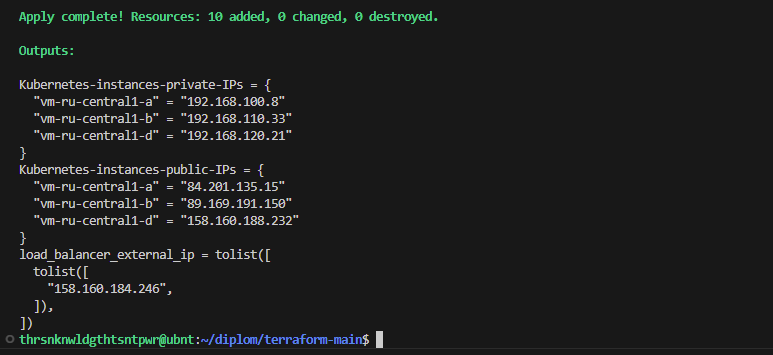
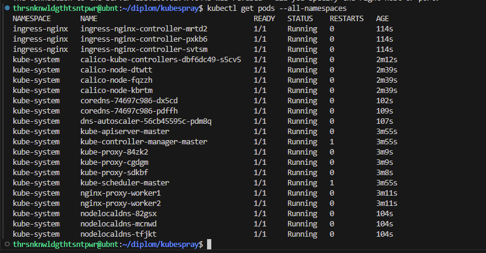

# Дипломный практикум в Yandex.Cloud
  * [Цели:](#цели)
  * [Этапы выполнения:](#этапы-выполнения)
     * [Создание облачной инфраструктуры](#создание-облачной-инфраструктуры)
     * [Создание Kubernetes кластера](#создание-kubernetes-кластера)
     * [Создание тестового приложения](#создание-тестового-приложения)
     * [Подготовка cистемы мониторинга и деплой приложения](#подготовка-cистемы-мониторинга-и-деплой-приложения)
     * [Установка и настройка CI/CD](#установка-и-настройка-cicd)
  * [Что необходимо для сдачи задания?](#что-необходимо-для-сдачи-задания)
  * [Как правильно задавать вопросы дипломному руководителю?](#как-правильно-задавать-вопросы-дипломному-руководителю)

---
## Цели:

1. Подготовить облачную инфраструктуру на базе облачного провайдера Яндекс.Облако.
2. Запустить и сконфигурировать Kubernetes кластер.
3. Установить и настроить систему мониторинга.
4. Настроить и автоматизировать сборку тестового приложения с использованием Docker-контейнеров.
5. Настроить CI для автоматической сборки и тестирования.
6. Настроить CD для автоматического развёртывания приложения.

---
## Этапы выполнения:


### Создание облачной инфраструктуры

1. Создаю два каталога для двух terraform-конфигураций
```
mkdir ~/diplom/terraform-main ~/diplom/terraform-prereq-bucket
```
2. Создаю сервисный аккаунт для каталога diplom-netology в Яндекс Облаке и авторизованный ключ для него через веб-интерфейс


3. Содержимое ключа помещаю в файл ~/diplom/terraform-prereq-bucket/authorized_keys/diplom-netology-admin_authorized_key.json
4. Добавляю .gitignore в каталог ~/diplom/terraform-prereq-bucket/authorized_keys/ с содержимым
```
*key*
```
5. Выполняю terraform init в каталоге ~/diplom/terraform-prereq-bucket
6. Добавляю стандартный для terraform-проекта .gitignore в каталоги ~/diplom/terraform-prereq-bucket/ и ~/diplom/terraform-main
7. Создаю provider.tf
```
terraform {
    required_providers {
        yandex = {
            source = "yandex-cloud/yandex"
        }
    }
}

provider "yandex" {
    zone = var.default_zone
    service_account_key_file = var.authorized_key_file
    cloud_id = var.cloud_id
    folder_id = var.folder_id
}
```
8. Добавляю variables.tf
```
variable "cloud_id" {
    type = string
    description = "Yandex.Cloud Identifier"
}
variable "folder_id" {
    type = string
    description = "Folder Identifier"
}
variable "default_zone" {
    type = string
    description = "Default Zone"
}
variable "authorized_key_file" {
    type = string
    description = "Path to Storage.editor Service Account's authorized_key file"
}
variable "storage_class" {
    type = string
    description = "Bucket's storage class (STANDARD/COLD/ICE)"
}
```
9. terraform.tfvars выглядит следующим образом
```
cloud_id = "b1gmrdbulmjk5vov6tbl"
folder_id = "b1gracaa21gumqmcihci"
default_zone = "ru-central1-a"
authorized_key_file = "./authorized_keys/diplom-netology-admin_authorized_key.json"
storage_class = "STANDARD"
```
10. main.tf, в котором, собственно создаю бакет и сервисный аккаунт для него
```
resource "yandex_storage_bucket" "terraform_state" {
  bucket     = "terraform-state-${var.folder_id}"
  default_storage_class = var.storage_class
  force_destroy = true
  acl = "private"
  access_key = yandex_iam_service_account_static_access_key.sa_key.access_key
  secret_key = yandex_iam_service_account_static_access_key.sa_key.secret_key
}

resource "yandex_iam_service_account" "sa" {
  name = "sa"
  folder_id = var.folder_id
}

resource "yandex_iam_service_account_static_access_key" "sa_key" {
  service_account_id = yandex_iam_service_account.sa.id
}

resource "yandex_resourcemanager_folder_iam_binding" "storage_editor" {
  folder_id = var.folder_id
  role      = "storage.editor"
  members   = ["serviceAccount:${yandex_iam_service_account.sa.id}"]
}

output "bucket_name" {
  value = yandex_storage_bucket.terraform_state.bucket
}

output "access_key" {
  value = yandex_iam_service_account_static_access_key.sa_key.access_key
}

output "secret_key" {
  value = yandex_iam_service_account_static_access_key.sa_key.secret_key
  sensitive = true
}
```
11. Выполняю terraform apply


12. Выполняю команду terraform output secret_key, чтобы получить содержимое закрытого ключа от сервисного аккаунта с ролью storage.editor
13. Добавляю полученные ключи в переменные окружения $ACCESS_KEY и $SECRET_KEY
```
export ACCESS_KEY=YCAJEX2BtfEqiC4w....
export SECRET_KEY=YCMbjPJDul3Pyrpj....
```
14. Перехожу к каталогу terraform-main. Описываю backend вместе с провайдером в файле provider.tf
```
terraform {
    required_providers {
        yandex = {
            source = "yandex-cloud/yandex"
        }
    }
    backend "s3" {
        endpoints = {
            s3 = "https://storage.yandexcloud.net"
        }
        bucket = "terraform-state-b1gracaa21gumqmcihci"
        region = "ru-central1"
        key = "terraform.tfstate"
        skip_region_validation = true
        skip_credentials_validation = true
        skip_requesting_account_id = true
        skip_s3_checksum = true
    }
}

provider "yandex" {
    zone = var.default_zone
    service_account_key_file = var.authorized_key_file
    cloud_id = var.cloud_id
    folder_id = var.folder_id
}
```
15. Выполняю команду terraform init -backend-config="access_key=$ACCESS_KEY" -backend-config="secret_key=$SECRET_KEY"


16. Создаю каталог ~/diplom/terraform-main/authorized_keys и помещаю в него авторизованный ключ сервисного аккаунта, публичный ssh-ключ и .gitignore-файл
```
mkdir ~/diplom/terraform-main/authorized_keys
cp -R ~/diplom/terraform-prereq-bucket/authorized_keys/* ~/diplom/terraform-main/authorized_keys/
cp ~/.ssh/id_ed25519.pub ~/diplom/terraform-main/authorized_keys/
```
17. Описываю переменные для создаваемых инстансов в файле vm-variables.tf
18. Описываю переменные для доступа к Яндекс Облаку в файле variables.tf
19. terraform.tfvars выглядит так:
```
cloud_id = "b1gmrdbulmjk5vov6tbl"
folder_id = "b1gracaa21gumqmcihci"
default_zone = "ru-central1-a"
authorized_key_file = "./authorized_keys/diplom-netology-admin_authorized_key.json"
platform_id = "standard-v3"
vm-cores = 2
vm-ram = 4
vm-core_fraction = 100
vm-preemptible = true
vm-disk-image_id = "fd81evq9jnnqoa0pc7vf"
vm-disk-size = 20
vm-disk-type = "network-hdd"
```
20. Добавляю файл kubernetes-instances.tf с описанием инстансов и подсетей, которые хочу создать
```
locals {
  subnets = {
    "subnet-ru-central1-a" = { zone = "ru-central1-a", cidr = "192.168.100.0/24" },
    "subnet-ru-central1-b" = { zone = "ru-central1-b", cidr = "192.168.110.0/24" },
    "subnet-ru-central1-d" = { zone = "ru-central1-d", cidr = "192.168.120.0/24" }
  }
  vms = {
    "vm-ru-central1-a" = { zone = "ru-central1-a", subnet_name = "subnet-ru-central1-a" },
    "vm-ru-central1-b" = { zone = "ru-central1-b", subnet_name = "subnet-ru-central1-b" },
    "vm-ru-central1-d" = { zone = "ru-central1-d", subnet_name = "subnet-ru-central1-d" }
  }
}

resource "yandex_vpc_network" "kuber-network" {
    name = "kuber-network"
}

resource "yandex_vpc_subnet" "subnet" {
  for_each       = local.subnets
  name           = each.key
  zone           = each.value.zone
  network_id     = yandex_vpc_network.kuber-network.id
  v4_cidr_blocks = [each.value.cidr]
}

resource "yandex_compute_instance" "kuber-vm" {
  for_each    = local.vms
  name        = each.key
  platform_id = var.platform_id
  zone        = each.value.zone
  allow_stopping_for_update = true
  resources {
    cores  = var.vm-cores
    memory = var.vm-ram
    core_fraction = var.vm-core_fraction
  }
  scheduling_policy {
    preemptible = var.vm-preemptible
  }
  boot_disk {
    initialize_params {
      image_id = var.vm-disk-image_id
      type = var.vm-disk-type
      size = var.vm-disk-size
    }
  }
  network_interface {
    index = 0
    subnet_id = yandex_vpc_subnet.subnet[each.value.subnet_name].id
    nat       = true
  }
  metadata = {
    ssh-keys = "ubuntu:${file("./authorized_keys/id_ed25519.pub")}"
  }
}

output "Kubernetes-instances-private-IPs" {
  value = { for k, v in yandex_compute_instance.kuber-vm : k => v.network_interface.0.ip_address }
  description = "Private IP addresses of the created instances"
}
output "Kubernetes-instances-public-IPs" {
  value = { for k, v in yandex_compute_instance.kuber-vm : k => v.network_interface.0.nat_ip_address }
  description = "Public IP addresses of the created instances"
}
```
21. Выполняю terraform apply в каталоге ~/diplom/terraform-main


22. Выполняю terraform destroy, чтобы убедиться, что всё ок


---
### Создание Kubernetes кластера

1. Для работы с kubespray понадобится: 
- склонировать репозиторий https://github.com/kubernetes-sigs/kubespray на свою ВМ
- установить ansible и pip3

```
sudo apt install ansible pyhon3-pip -y
cd ~/diplom && git clone https://github.com/kubernetes-sigs/kubespray
cd kubespray && pip install -r requirements.txt

```


2. Копирую пример конфига кластера в отдельную директорию
```
cp -rfp inventory/sample inventory/netology-cluster
```
3. В каталог terraform-main добавляю файл ansible_inventoy.tf в котором описана автоматическая генерация inventory-файла для kubespray
```
locals {

  vm_roles = {
    "vm-ru-central1-a" = "master"
    "vm-ru-central1-b" = "worker1"
    "vm-ru-central1-d" = "worker2"
  }

  hosts = {
    for vm_name, instance in yandex_compute_instance.kuber-vm : local.vm_roles[vm_name] => {
      ansible_host = instance.network_interface.0.nat_ip_address
      access_ip    = instance.network_interface.0.nat_ip_address
      ip           = instance.network_interface.0.ip_address
      ansible_user = "ubuntu"
    }
  }
}

resource "local_file" "ansible_inventory" {
  content = templatefile("${path.module}/inventory.tmpl", {
    hosts = local.hosts
  })
  filename = "${path.module}/../kubespray/inventory/netology-cluster/inventory.yml"
}
```
4. В файле ~/diplom/kubespray/inventory/netology-cluster/group_vars/k8s_cluster/k8s-cluster.yml ищу параметр kubeconfig_localhost и выставляю его в true для того, чтобы на локальной машине появился конфиг подключения к кластеру. Также снимаю комментарий с этой строки

5. Запускаю terraform apply снова, для того, чтобы сгенерировать inventory-файл
```
cd ~/diplom/terraform-main && terraform apply
```
```
all:
  hosts:
    master:
      ansible_host: 158.160.57.73
      access_ip: 158.160.57.73
      ip: 192.168.100.14
      ansible_user: ubuntu
    worker1:
      ansible_host: 84.201.164.7
      access_ip: 84.201.164.7
      ip: 192.168.110.33
      ansible_user: ubuntu
    worker2:
      ansible_host: 158.160.187.46
      access_ip: 158.160.187.46
      ip: 192.168.120.17
      ansible_user: ubuntu
  children:
    kube_control_plane:
      hosts:
        master:
    kube_node:
      hosts:
        master:
        worker1:
        worker2:
    etcd:
      hosts:
        master:
    k8s_cluster:
      children:
        kube_control_plane:
        kube_node:
```

6. Запускаю ansible-playbook
```
cd ../kubespray/ && ansible-playbook -i inventory/netology-cluster/inventory.yml cluster.yml -b
```
7. Устанавливаю kubectl на локальную ВМ
```
sudo snap install kubectl --classic
```
8. Копирую содержимое файла ~/diplom/kubespray/inventory/netology-cluster/artifacts/admin.conf в файл ~/.kube/config
```
mkdir ~/.kube && cp ~/diplom/kubespray/inventory/netology-cluster/artifacts/admin.conf ~/.kube/config
```
9. Проверяю подключение к кластеру
```
kubectl get pods --all-namespaces
```



---
### Создание тестового приложения

Для перехода к следующему этапу необходимо подготовить тестовое приложение, эмулирующее основное приложение разрабатываемое вашей компанией.

Способ подготовки:

1. Рекомендуемый вариант:  
   а. Создайте отдельный git репозиторий с простым nginx конфигом, который будет отдавать статические данные.  
   б. Подготовьте Dockerfile для создания образа приложения.  
2. Альтернативный вариант:  
   а. Используйте любой другой код, главное, чтобы был самостоятельно создан Dockerfile.

Ожидаемый результат:

1. Git репозиторий с тестовым приложением и Dockerfile.
2. Регистри с собранным docker image. В качестве регистри может быть DockerHub или [Yandex Container Registry](https://cloud.yandex.ru/services/container-registry), созданный также с помощью terraform.

---
### Подготовка cистемы мониторинга и деплой приложения

Уже должны быть готовы конфигурации для автоматического создания облачной инфраструктуры и поднятия Kubernetes кластера.  
Теперь необходимо подготовить конфигурационные файлы для настройки нашего Kubernetes кластера.

Цель:
1. Задеплоить в кластер [prometheus](https://prometheus.io/), [grafana](https://grafana.com/), [alertmanager](https://github.com/prometheus/alertmanager), [экспортер](https://github.com/prometheus/node_exporter) основных метрик Kubernetes.
2. Задеплоить тестовое приложение, например, [nginx](https://www.nginx.com/) сервер отдающий статическую страницу.

Способ выполнения:
1. Воспользоваться пакетом [kube-prometheus](https://github.com/prometheus-operator/kube-prometheus), который уже включает в себя [Kubernetes оператор](https://operatorhub.io/) для [grafana](https://grafana.com/), [prometheus](https://prometheus.io/), [alertmanager](https://github.com/prometheus/alertmanager) и [node_exporter](https://github.com/prometheus/node_exporter). Альтернативный вариант - использовать набор helm чартов от [bitnami](https://github.com/bitnami/charts/tree/main/bitnami).

### Деплой инфраструктуры в terraform pipeline

1. Если на первом этапе вы не воспользовались [Terraform Cloud](https://app.terraform.io/), то задеплойте и настройте в кластере [atlantis](https://www.runatlantis.io/) для отслеживания изменений инфраструктуры. Альтернативный вариант 3 задания: вместо Terraform Cloud или atlantis настройте на автоматический запуск и применение конфигурации terraform из вашего git-репозитория в выбранной вами CI-CD системе при любом комите в main ветку. Предоставьте скриншоты работы пайплайна из CI/CD системы.

Ожидаемый результат:
1. Git репозиторий с конфигурационными файлами для настройки Kubernetes.
2. Http доступ на 80 порту к web интерфейсу grafana.
3. Дашборды в grafana отображающие состояние Kubernetes кластера.
4. Http доступ на 80 порту к тестовому приложению.
5. Atlantis или terraform cloud или ci/cd-terraform
---
### Установка и настройка CI/CD

Осталось настроить ci/cd систему для автоматической сборки docker image и деплоя приложения при изменении кода.

Цель:

1. Автоматическая сборка docker образа при коммите в репозиторий с тестовым приложением.
2. Автоматический деплой нового docker образа.

Можно использовать [teamcity](https://www.jetbrains.com/ru-ru/teamcity/), [jenkins](https://www.jenkins.io/), [GitLab CI](https://about.gitlab.com/stages-devops-lifecycle/continuous-integration/) или GitHub Actions.

Ожидаемый результат:

1. Интерфейс ci/cd сервиса доступен по http.
2. При любом коммите в репозиторие с тестовым приложением происходит сборка и отправка в регистр Docker образа.
3. При создании тега (например, v1.0.0) происходит сборка и отправка с соответствующим label в регистри, а также деплой соответствующего Docker образа в кластер Kubernetes.

---
## Что необходимо для сдачи задания?

1. Репозиторий с конфигурационными файлами Terraform и готовность продемонстрировать создание всех ресурсов с нуля.
2. Пример pull request с комментариями созданными atlantis'ом или снимки экрана из Terraform Cloud или вашего CI-CD-terraform pipeline.
3. Репозиторий с конфигурацией ansible, если был выбран способ создания Kubernetes кластера при помощи ansible.
4. Репозиторий с Dockerfile тестового приложения и ссылка на собранный docker image.
5. Репозиторий с конфигурацией Kubernetes кластера.
6. Ссылка на тестовое приложение и веб интерфейс Grafana с данными доступа.
7. Все репозитории рекомендуется хранить на одном ресурсе (github, gitlab)

